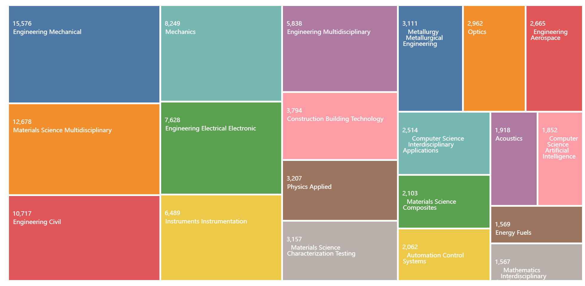
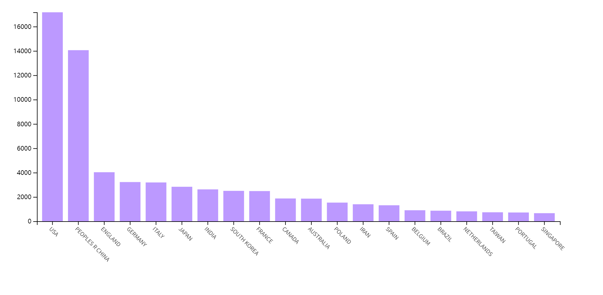
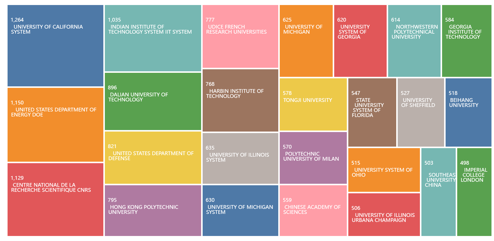
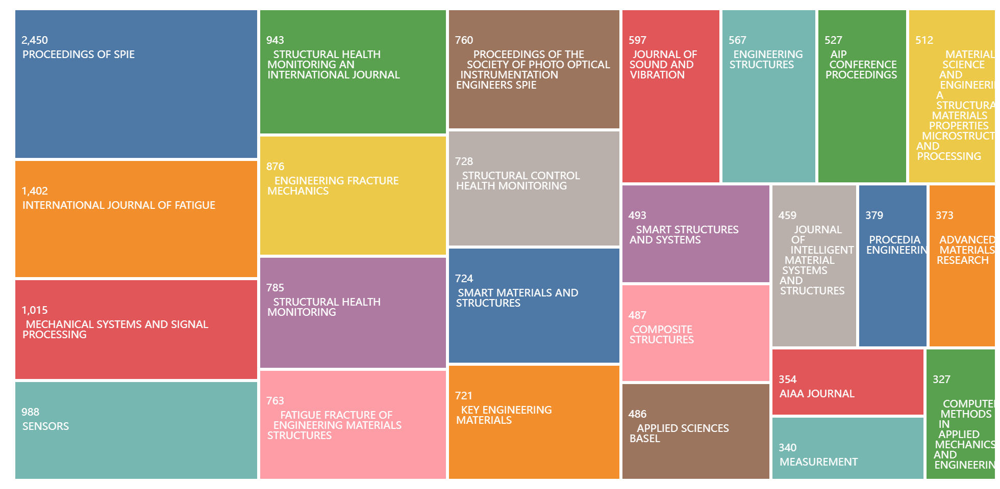
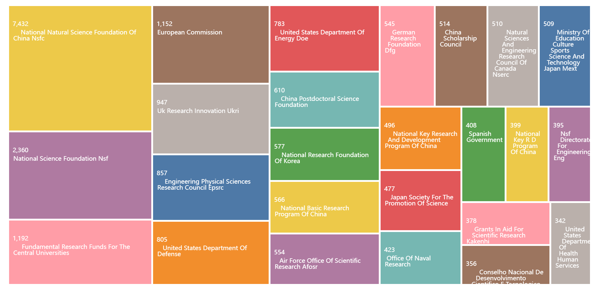

## 研究兴趣介绍

在北京航空航天大学的前两年，我专注于研究航空结构的结构完整性和数字孪生，探索利用数字孪生技术来提高航空结构的结构完整性。2021年，我在米兰理工大学攻读双博士学位。在这里，我的研究与结构健康监测（SHM）相结合，这是确保航空结构安全性的关键技术。机器学习在我的研究中也发挥了重要作用，特别是构建复杂结构仿真的代理模型。

在下面的章节中，将通过欧盟、意大利和中国的学科分类标准、Web of Science平台和在线学术社交网站ResearchGate来分析我的研究社区。所确定的社区在范围上逐渐变小，从而提供了多种尺度的视角。

## 通过多个学科分类标准确定我的研究社区

### ERC欧洲研究委员会 (2020)

PE6\_12 Scientific computing, simulation and modelling tools

PE7\_3 Simulation engineering and modelling

PE8\_1 Aerospace engineering

PE8\_7 Mechanical and manufacturing engineering (shaping, mounting, joining, separation)

### 意大利教育部 (2023)

ING-IND/04 Aerospace structures and design

ING-IND/13 Applied mechanics

ING-IND/14 Mechanical design and machine construction

### 教育部学科分类

0801 力学 080102 固体力学

0802 机械工程 080203 机械设计与理论

0825 航空宇航科学与技术 082501 飞行器设计

## 通过Web of Science识别我的研究社区

在本节中，我们利用Web of Science平台来探索我的研究社区。根据我的研究兴趣确定了一系列关键词，并利用Web of Science的搜索结果对我的研究社区中的学科、国家、机构和资助机构的分布进行了分析。

在查询了Web of Science核心库的61,620个结果后，利用 "分析结果 "的功能，深入了解了我的研究社区中的学科、国家/地区、机构和参与资助的机构。

### 学科分布

**图1 所查询的出版物的Web of Science类别.**

图1显示，研究社区内涉及的学科种类繁多，最主要的是机械工程，其次是材料科学-多学科、土木工程和力学。航空航天工程仅排名13，这意味着与前面的学科相比，它的规模相对较小。这一发现指出了一个事实，即结构完整性和健康监测问题适用于广泛的工程结构，并与材料和力学密切相关，因此具有很高的可信度。鉴于这些结果，我需要将我的关注点扩大到传统学科之外，以获得对该领域的全面了解，进而探索新的研究途径，参与跨学科合作，从而获得重大突破。

### 国家/地区分布

**图2 所查询的出版物的国家/地区分布.**

图2的结果显示，在该领域美国和中国是主导者，其他国家如英国、德国和意大利则落后。值得注意的是，如果我们考虑到欧盟内部的主要国家，并将其研究产出汇总，其规模与中国和美国相当。这些发现表明，目前这一领域的研究仍然呈现出三足鼎立的局面，这与这些国家的经济地位和工业发展程度呈正相关。换句话说，经济和工业发展程度较高的国家往往在工程领域有更多的研究产出。

### 机构分布

**图3 所查询出版物的机构分布.**

图3中对机构的分析表明，我的研究社区很大的比重位于美国的机构中，加利福尼亚大学系统和美国能源部占据了前两位，这与图2中显示的结果相符。其他机构包括法国国家科学研究中心CNRS、印度理工学院系统、大连理工大学、美国国防部、香港理工大学。 此外，米兰理工大学和北京航空航天大学分别排名17和21，表明它们在研究界也享有一定的知名度。

### 出版物标题分布

**图4 所查询出版物的出版物标题分布.**

图4显示了我的研究社区中前25个出版物标题。最经常出现的出版物标题是 "Proceedings of SPIE"。"International Journal of Fatigue"和 "Mechanical Systems and Signal Processing"分别紧随其后。此外，还列出了几个会议论文集，如 "AIP Conference Proceedings"和 "Procedia Engineering"，这表明我的研究社区可能正在积极参加学术会议。我最常发表的期刊AIAA Journal仅排名第23位，这表明我的研究可能在航空航天领域的同行中受关注，但可能难以获得整个研究界的广泛关注。另一方面，在MSSP上发表的研究成果可能有更大的曝光潜力。

### 资助机构分布

**图5 所查询出版物的资助机构分布.**

鉴于工程领域的研究与政府政策和产业发展密切相关，其资金来源极为重要。如图 5 所示，中国国家自然科学基金委员会（NSFC）成为研究界的主要资助机构，其次是美国国家科学基金会（NSF），是第二大资助机构。其他重要的资助机构包括中央大学的基础研究基金、欧盟委员会、英国研究创新（UKRI）和工程物理科学研究委员会（EPSRC）。

数据还显示，来自中国、美国、欧洲、日本和加拿大等不同国家和地区的资金在研究界广泛盛行，这与这些国家目前的数字化转型战略密切相关。值得注意的是，美国国防部和美国能源部（DOE）是该研究界的主要资助机构，这表明该领域的很大一部分研究可能与军事相关的应用。

## 通过ResearchGate识别我的研究社区

在本节中，将对我的研究社区的一个更为个人化的方面进行调查。个人数据来自一个著名的在线网站[ResearchGate](https://www.researchgate.net/)，该网站帮助研究人员建立联系，使他们能够轻松地分享和获取科学成果、知识和专业技能，我们利用这些数据进行分析。由于可访问性，我们只分析了ResearchGate会员在过去8周的阅读信息。

### 学科分布

表1列出了过去8周内读者的学科分布，显示最大的读者群来自机械工程，与我的专业领域很一致。接下来的两个最大的社区，航空工程和航天工程，也与我正在进行的专业领域相一致。此外，一个较小但值得注意的读者群表示对人工神经网络和人工智能感兴趣，表明我的工作与计算机科学领域有重叠之处。然而，与其他学科相比，对制造工程和工业工程感兴趣的读者数量相对较少。考虑到我的研究重点是工程结构的服役阶段，这一结果是合理的，也是在意料之中的。

**表1 过去8周内读者的学科分布。**

|**学科**|**计数**|
| :-: | :-: |
|机械工程|57|
|航空工程|31|
|航天工程|24|
|结构工程|18|
|力学|14|
|材料工程|12|
|人工神经网络|8|
|人工智能|8|
|制造工程|7
|应用数学|7
|数学、自然科学、工程和医学领域的计算|6
|汽车工程|5|
|工业工程|5|

### 国家/地区分布

考虑到表2所示的读者国家/地区分布，中国是拥有最多的读者的国家，其次是意大利和美国。这表明中国、意大利和美国的研究界对我的研究都有很大兴趣。总的来说，我的工作似乎在中国和更广泛的亚洲地区有很大的影响，世界上其他几个地方也对我的工作感兴趣。

**表2 过去8周内读者的国家/地区分布。**

|**国家/地区**|**计数**|**国家/地区**|**计数**|
| :-: | :-: | :-: | :-: |
|中国|101|加拿大|5|
|意大利|33|中国台湾|4|
|美国|15|英国|4|
|中国香港|10|德国|3|
|日本|8|俄罗斯|3|
|新加坡|7|巴西|3|
|印度|7|法国|3|

### 机构分布

表3列出了过去8周内读者机构的分布情况。结果显示，我的母校北京航空航天大学的读者数量最多，表明北京航空航天大学的研究界对我的研究很感兴趣。值得注意的是，米兰理工大学获得了第三名的位置，反映出它与我的被关注列表有紧密的联系。此外，中国的多所大学在读者人数方面也名列前茅。总的来说，我的工作显示了一定的全球影响力，读者来自多个国家的不同机构。

**表3 过去8周内读者的机构分布。**

|**机构**|**计数**|
| :-: | :-: |
|北京航空航天大学，中国|101|
|东北大学，中国|33|
|米兰理工大学，意大利|15|
大连理工大学，中国|10|
|华中科技大学，中国|8|
|圣保罗州立大学，巴西|7|
|大连海事大学，中国|7|
|圣彼得堡理工大学，俄罗斯|3|
|亚琛工业大学，德国|2|
|黑山大学，黑山|2|
|南京航空航天大学，中国|2|
|南昌大学，中国|2|
|亚利桑那州立大学，美国|2|
|布里斯托尔大学，英国|2|
|山东大学，中国|2|
|伦敦帝国学院，英国|2|

需要注意的是，ResearchGate的数据只涵盖了过去8周的时间，因此会有短期的波动，特别是近期出版物的影响。尽管如此，研究结果显示了与我的工作密切相关的研究界的明显特征。从学科上看，机械工程和航空工程在我的研究社区中表现出较大的倾向性。从地理上看，尽管也有其他国家的研究人员，但仍以中国、意大利和美国为主。从机构上看，我的研究社区集中在我所在大学--北京航空航天大学和米兰理工大学，同时也分散在中国的几所工科学校和世界各地的一些机构。

## 结论

在这篇文章中，通过各种方法从广义到狭义的口径分析了我的研究社区。首先，根据欧盟、意大利和中国的学科标准对学科分布进行分类，发现我的研究主要集中在机械工程和航空及航天工程方面。

其次，根据Web of Science平台的关键词搜索数据，分析了我的研究社区中的学科、国家、研究机构、出版物标题和资助机构的分布。分析结果显示，学科分布基本没有变化，美国、中国和欧盟几个主要国家是最主要的国家。加州大学系统在研究机构中排名第一，其次是美国、法国和印度的一些研究机构。米兰理工大学和北京航空航天大学分别排在第17和第21位。大多数出版物都集中在我所在社区的知名期刊上，同时还有一些会议论文集。资金主要来自中国、美国和欧洲的官方机构。

接下来，根据我经常使用的ResearchGate网站过去八周的读者数据，我对一个更小规模的研究社区进行了分析。整体数据与Web of Science的分析没有明显差异，但这个社区的研究人员更多集中在米兰理工大学和北京航空航天大学。

最后，我想对Paolo Volonté教授表示感谢，他一丝不苟的教学，多样化的课堂形式，强调与学生的互动和讨论，让我体验到了一种新的学习氛围。这项作业也使我能够更好地了解我的研究社区，对其有了更清晰的认识。我相信，从这门课程中获得的知识，包括这项作业的成果，将大大有利于我未来的研究事业。
